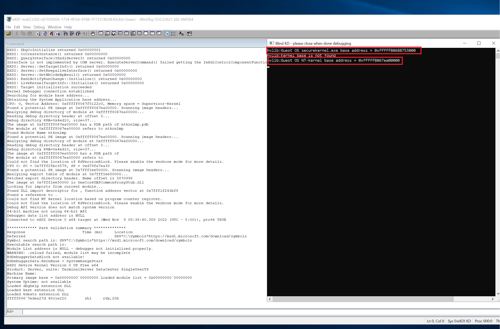
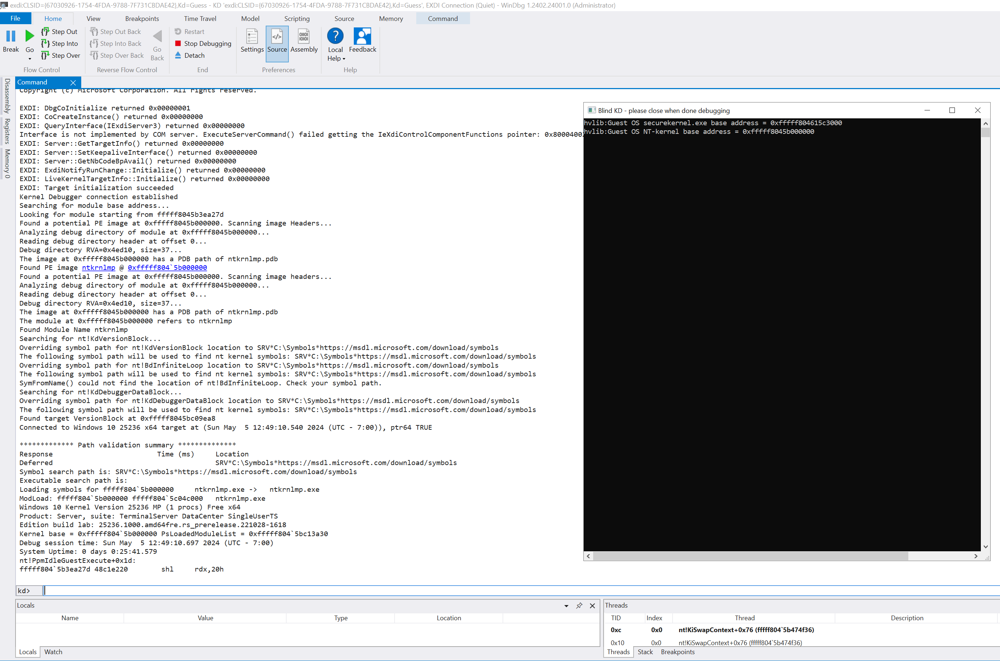

# Live debugging capabilities (beta stage)

LiveCloudKd EXDi module can be used for debugging Hyper-V guest OS without enable kernel debugging in bootloader.

Standard Hyper-V VM can be debugged too, but more intereseting is to debug securekernel part of Windows.
Docker containers, running in Hyper-V isolation mode, and Windows Sandbox can be debugged too, but EXDi module has some syncs problems in multi CPU environment (because all function's calls to EXDi go from blackboxing dbgeng.dll). EXDi works, but unexpected interruptions may be catched during tracing.

# Installation

EXDi is used for integration custom debugging engines with WinDBG.

LiveCloudKDExdi plugin in live debugging mode works with Hyper-V on Windows Server 2019 and Windows 10 20H1 (19041) as host OS. Guest OS can be various. 
It must work on Windows 10, build 1909, but i didn't test it.
Also EXDi plugin was tested on Windows 20H2 fast ring build (19569.1000.amd64fre.rs_prerelease.200214-1419) with Windows 10X emulator (but there is no symbols for guest Windows 10X ntoskrnl.exe on 08 march 2020 date)

1. Extract all files to WinDBG x64 10.0.1903 install directory (installer can be found in Windows SDK 10.0.18362.0 or WDK for Windows 10, version 1903)
2. Install Visual Studio 2019 runtime libraries - https://aka.ms/vs/15/release/vc_redist.x64.exe 
3. Register ExdiKdSample.dll using "regsvr32.exe ExdiKdSample.dll" command
4. Don't forget configure symbols path for WinDBG as usual:

```
mkdir C:\Symbols
compact /c /i /q /s:C:\Symbols
setx /m _NT_SYMBOL_PATH SRV*C:\Symbols*https://msdl.microsoft.com/download/symbols
```

# Start

1. Start LiveCloudKd with /l option: 

```
livecloudkd.exe /l /m 1 /v 2 
```

It automatically launches WinDBG with EXDi interface in live debugging mode using hvmm.sys driver and max logging mode.

2. You can see working WinDBG and separate logging windows:


3. Also you can directly start WinDBG using command

```
windbg.exe -d -v -kx exdi:CLSID={67030926-1754-4FDA-9788-7F731CBDAE42},Kd=Guess
```

but before you need create HKEY_LOCAL_MACHINE\SOFTWARE\LiveCloudKd\Parameters\VmId, type REG_DWORD and enter position number in LiveCloudKd list [0, 1, 2]. You can see that list, if you launch LiveCloudKd without parameters. If you launch 1 VM, that parameter will be 0.

You can use WinDBG Preview with EXDi plugin too. But WinDBG Preview has bug with automatically starting EXDi plugin from command line, therefore it must be start manually.

4. Create HKEY_LOCAL_MACHINE\SOFTWARE\LiveCloudKd\Parameters\VmId, type REG_DWORD and enter position number in LiveCloudKd list [0, 1, 2]. You can see that list, if you launch LiveCloudKd without parameters. If you launch 1 VM, that parameter will be 0.
5. Start WinDBGX, go to File-Start debugging-Attach to Kernel, open EXDi tab and paste string 

```
CLSID={67030926-1754-4FDA-9788-7F731CBDAE42},Kd=Guess
```

to field.



# Live debugging usage

1 CPU for guest OS for live debugging is preferrable. MultiCPU version was developped recently and was't test enough (the most of tests was done on Windows 10X emulator)
Experimented multi-CPU debugging was added. For successfull debugging you need set Debug-Event Filters->Break instruction exception to Handle->Not Handle, and Execution->Output. 

Set breakpoint using "bp" command, press "Run", wait until breakpoint was triggered. You can set 0x1000 breakpoints now. It is software-like breakpoints, and not limited. You can use single step command.
For debugging securekernel:

1. See securekernel.exe base address in logging output window
2. Execute command in WinDBG:

```
.reload /f securekernel.exe=<securekernel_base_address>
```

3. Make breakpoint (you need enter to securekernel context)

```
bp securekernel!IumInvokeSecureService
```

4. After bp was triggered, execute .reload command. In WinDBG Preview you need press Ctrl+Alt+V for enabling verbose mode (no chance to enable it from cmd line - Dbg.Shell.X doesn't get additional parameters, when it launching in EXDi mode).
Search images load addresses in pattern:

```
The image at <module_base_address> is securekernel.exe
The image at <module_base_address> is SKCI.dll
The image at <module_base_address> is cng.sys 
```



5. Reload symbols for all modules, that will be found by WinDBG:

```
.reload /f securekernel.exe=<module_base_address> - no need for WinDBGX
.reload /f SKCI.dll=<module_base_address>
.reload /f cng.sys=<module_base_address>
```

You can load standard address space modules using same commands even you inside securekernel context

```
.reload /f ntkrnlmp.exe=<module_base_address>
```

6. Script idt_securekernel_parse_pykd.py inside archive for demo.
7. You can attach EXDi plugin to Windows 10X emulator, but breakpoints will bot be working because interceptions in nested virtualization mode (emulator uses it) doesn't work properly.


You can see demo video on youtube:

1. Debugging Hyper-V Windows Server 2019 guest OS using LiveCloudKd EXDI plugin - https://youtu.be/_8rQwB-ESlk
2. Microsoft Windows Server 2019 securekernel live debugging using WinDBG EXDi LiveCloudKd plugin - https://youtu.be/tRLQwsJQ-hU

# Settings

There are some settings can be configured through Windows Registry (see file RegParam.reg in distrib). Path HKEY_LOCAL_MACHINE\SOFTWARE\LiveCloudKd\Parameters. All params are dword, can be 0 or 1.

1. ScanGuestOsImages - try to scan physical memory for MZ-signature (can be useful for Windows 10X emulator).
2. VSMScan - enable VSM scanning for guest OS
3. UseDebugApiStopProcess - core applications, which manage container like Windows Sandbox and WDAG, must be be stopped in SuspendVm operation (otherwise they switch on vmwp.exe and guest's cpus after manual stopping)

	2 methods are used for that:
	
		- NtResumeProcess\NtSuspendProcess functions
		- DebugActiveProcess\DebugActiveProcessStop functions (need additional thread for it)
	
	UseDebugApiStopProcess parameter enables DebugActiveProcess\DebugActiveProcessStop functions


# Remarks

1. If you close debugger modules (WinDBG, or output windows, or corresponding dllhost.exe process) VM can be in suspended state. 
	For resuming it without reset start LiveCloudKd with /p option, select VM from list and then select 
	
```
	4 - Resume partition.
```
	
	NtSuspendProcess and NtResumeProcess are using for manage of state vmwp.exe process. It is not need for Windows Server 2019 (stopping of virtual cpus is enough), but need for Windows 10 (because of difference in CPU scheduler). If something wrong, process can be resuming using Process Explorer from SysinternalsSuite.
	
2. Securekernel debugging in EXDi mode is unexplored feature, there are many problems can be triggered in debugging process, so first make test (you can see example on early mentioned video):

```
bp securekernel!IumAllocateSystemHeap
bp securekernel!IumInvokeSecureService
```

then press F5 (Go command) in WinDBG or WinDBGX, if bp was triggered, repeat it. If it will be successfull, try make simple tracing in securekernel using:

```
bp securekernel!IumAllocateSystemHeap "r rcx;g"
```
command

3. Sometimes (not often) WinDBG can suddenly break in random code, as a usual debugging. It can be caused by some other exception during debugging. When that exception occures, there is no "breakpoint # hit" message.


4. You can switch register's context to VTL1, using "wrmsr 0x1111 1" command. "wrmsr 0x1111 0" switch back to VTL0. VTL0 and VTL1 memory is accessible all time.
5. If you want restart VM, but Hyper-V show error about existing partition, see, that LiveCloudKd, WinDBG console message windows are closed. LiveCloudKd duplicate some handles from vmwp.exe. You can manually unload debugger driver, if you kill WinDBG process, becuase some interception message will be handled by driver.

```
net stop hvmm
```