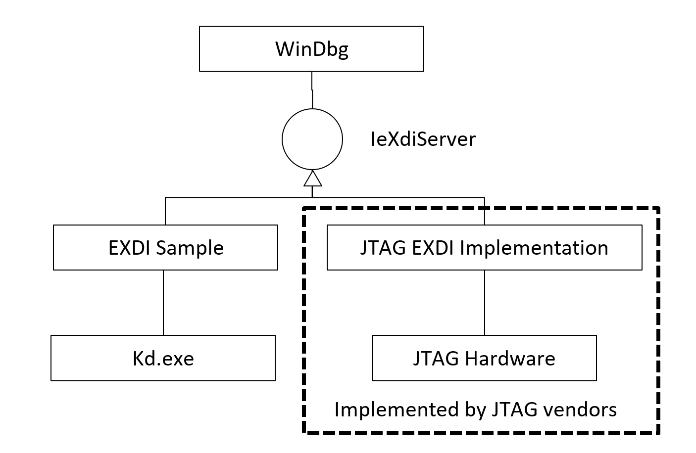
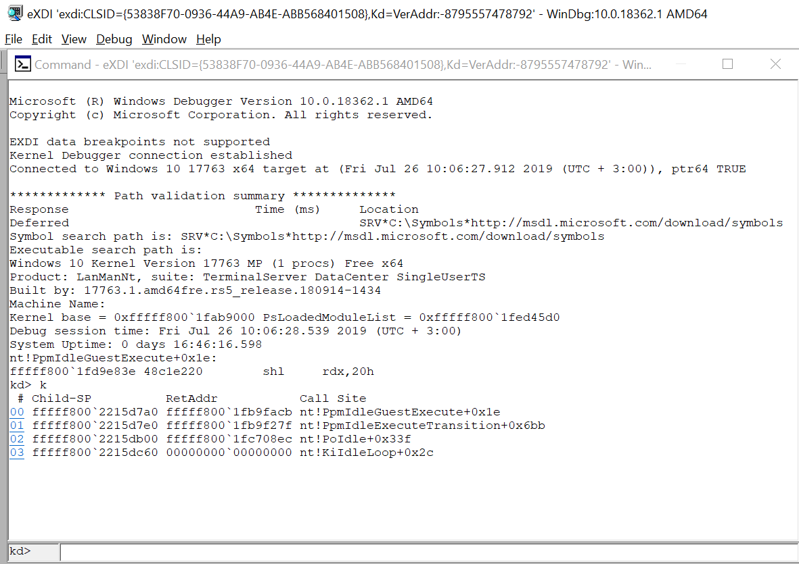
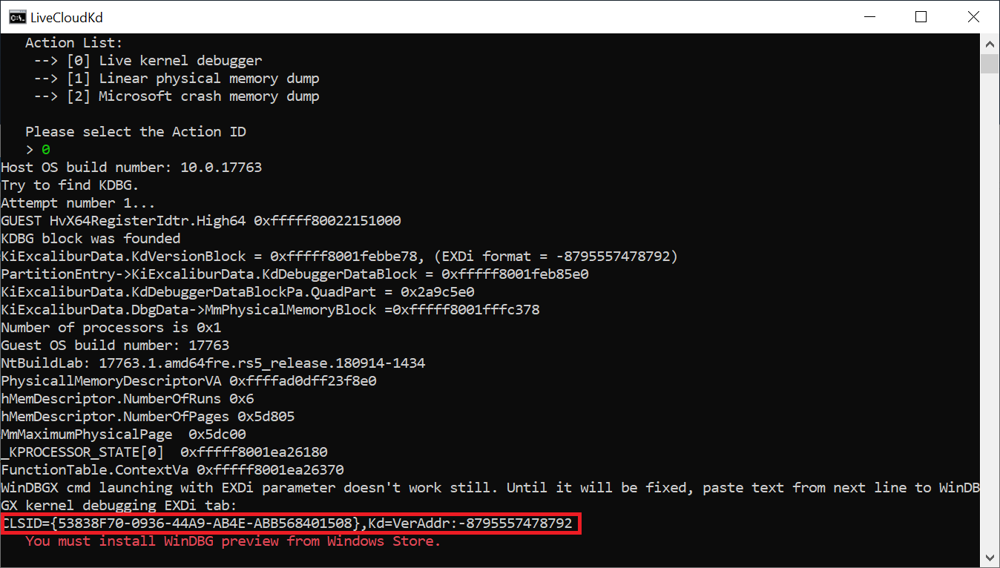
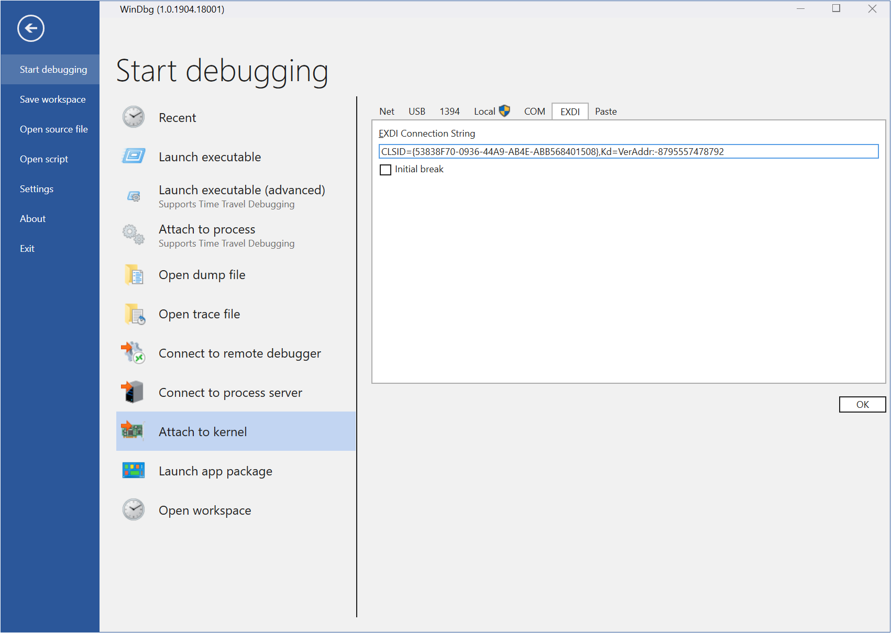
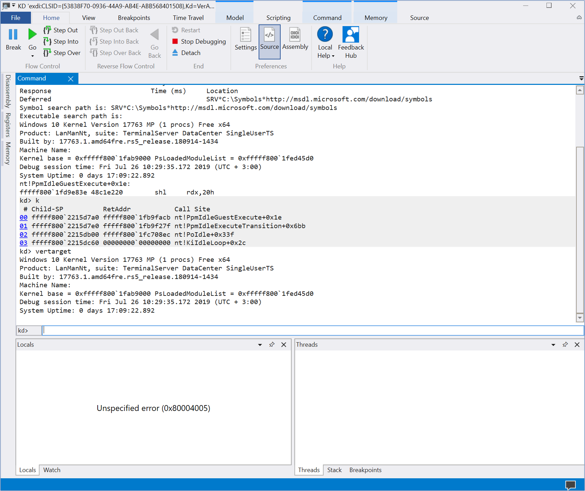

This project is modified EXDPlugins example from WinDBG SDK
(C:\Program Files (x86)\Windows Kits\10\Debuggers\x64\sdk\samples\exdi\ExdiKdSample)

It uses LiveCloudKdSdk library for reading and writing memory operations, get registers.

There is readme.docx in ExdiKdSample project in WinDBG SDK directory, which describe architecture of EXDi interface. If shortly,
EXDI is an interface that allows extending WinDBG by adding support for hardware debuggers. We haven't hardware debuggers for Hyper-V, but we can add LiveCloudKdSdk functions calling to EXDi interface.

For installation: 

1. Copy LiveCloudKd.exe, LiveCloudKdSdk.dll, hvmm.sys, vidaux.dll (only for ReadInterfaceVidAux method) and ExdiKdSample.dll to WinDBG x64 directory
2. Register ExdiKdSample.dll using regsvr32.exe ExdiKdSample.dll command
3. Start LiveCloudKd with /w option: LiveCloudKd.exe /w. It is automatically launch WinDBG with EXDi interface.

You can use WinDBG Preview with EXDi plugin too. But WinDBG Preview has bug with automatically starting EXDi plugin from command line, therefore it must be start manually.

1. Launch LiveCloudKd.exe /x.
2. Copy string, which provided by LiveCloudKd. 

3. Start WinDBGX, go to File-Start debugging-Attach to Kernel, open EXDi tab and paste string to field.

4. You can read\write to guest OS memory and execute WinDBG commands, that work for dump files. Remember, that it is static plugin example, and you can't do single step (F11, F8) or running commands (F5).

