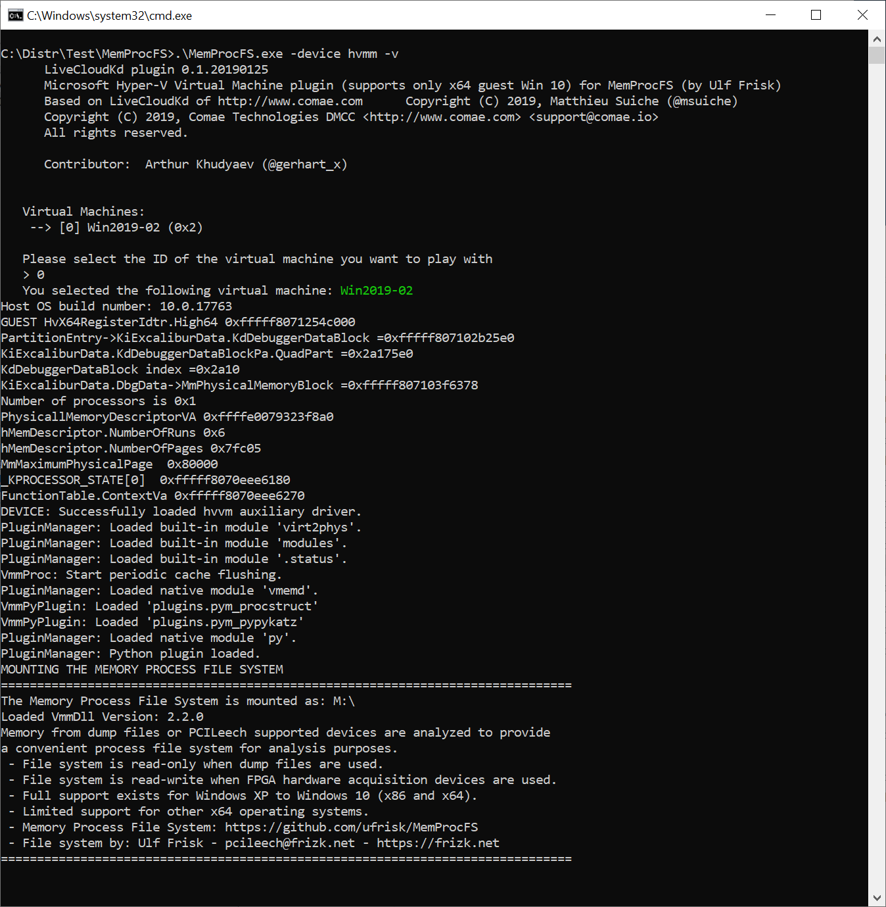
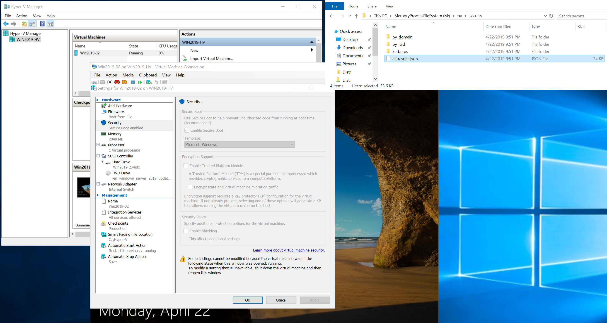

This is MemProcFs (by @ulfrisk) plugin for reading Hyper-V Memory using LiveCloudKdSdk

Sources was taken from https://github.com/ufrisk/LeechCore

- MemProcFs can be found on https://github.com/ufrisk/MemProcFS

- LiveCloudKd (original version) https://github.com/comaeio/LiveCloudKd

For starting copy modified version of leechcore.dll with LiveCloudKdSdk.dll and hvmm.sys to MemProcFs folder

start MemProcFs:
.\MemProcFS.exe -device hvmm -v

you must see something like that:

Next you can go to M: driver and use pypykatz plugin, f.e.

