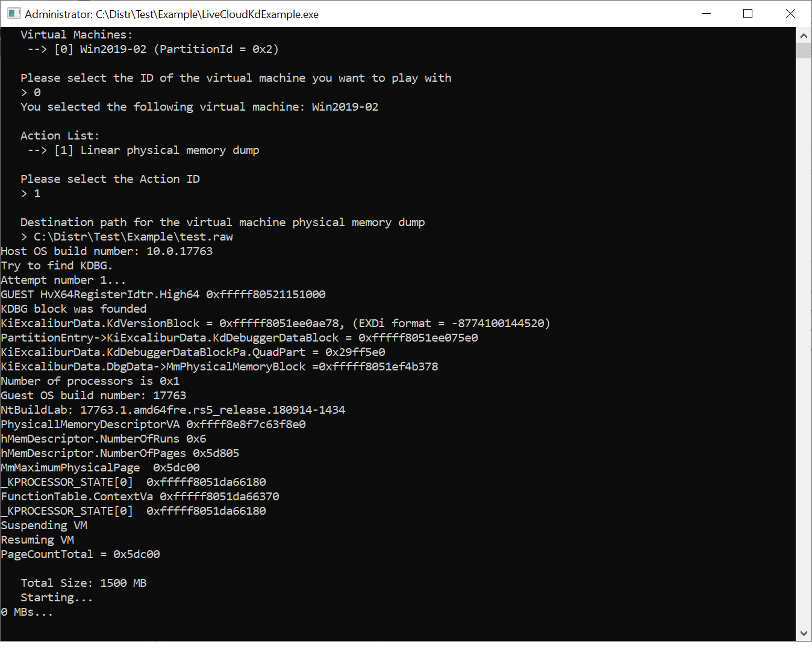

Demo project with next functions of LiveCloudKdSdk:

(Before compiling check include and library directories, that must point to LiveCloudKdSdkPublic.h and LiveCloudKdSdk.lib, which can be taken from LiveCloudKdSdk project)

- read physical memory
- read virtual memory
- suspend VM (need Powershell Hyper-V modules, for Windows containers have to use SuspendResumeWriteSpecRegister SUSPEND_RESUME_METHOD parameter)
- resume VM (need Powershell Hyper-V modules, for Windows containers have to use SuspendResumeWriteSpecRegister SUSPEND_RESUME_METHOD parameter)
- dump VM to file

Demo1 function uses full PHVDD_PARTITION structure for working with partition.
Demo2 using more simple HANDLE struct for using with non-C languages. (ULONG, PVOID, WCHAR types only).

