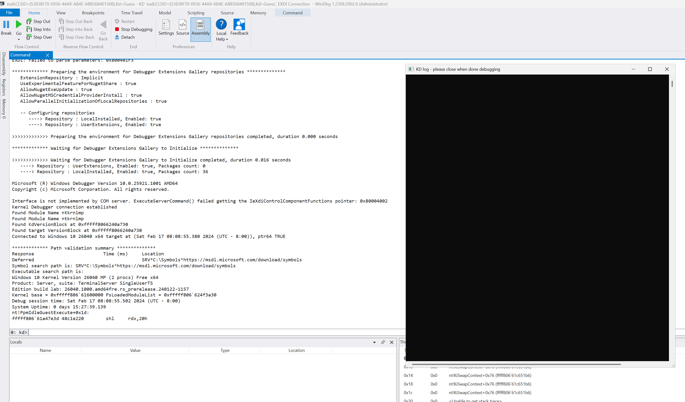

# LiveCloudKd
## Introduction
LiveCloudKd was the first utility to focus on Virtual Machine introspection for memory forensics purposes, it was released in 2010 after some initial research on Hyper-V v1.

This feature was later added into LiveKd 5.0 by Mark Russinovich and Ken Johnson.
https://blogs.technet.microsoft.com/markrussinovich/2010/10/09/livekd-for-virtual-machine-debugging/

### Original Author
- Matt Suiche [(www.msuiche.com)](https://www.msuiche.com)
### Maintainer
- [@gerhart_x](https://twitter.com/gerhart_x)

## Getting Started
Configure symbol path:
``` 
mkdir C:\Symbols
compact /c /i /q /s:C:\Symbols
setx /m _NT_SYMBOL_PATH SRV*C:\Symbols*https://msdl.microsoft.com/download/symbols
```

For launch:

1. Extract LiveCloudKd.exe, hvlib.dll, hvmm.sys to WinDBG x64 folder (tested on WinDBG from WDK 1809 - 23H2) or separate folder (use /y key for specify directory with WinDBG). 
   Also LiveCloudKd can find path to WinDBG, if it was installed with Windows WDK or SDK
2. Launch LiveCloudKd.exe with admin rights (It needs Visual Studio 2022 runtime libraries - https://aka.ms/vs/17/release/vc_redist.x64.exe).
3. Choose Hyper-V virtual machine for inspection.  

When starting LiveCloudKd searches WinDBG in next steps:

1. Standard Windows SDK installation folder (using register key)
2. in Windows Registry HKLM\Software\LiveCloudKd\Parameters in WinDbgPath key. See RegParam.key for instance. 
3. Set /y parameter with WinDBG path, for instance: 

```
LiveCloudKd /y C:\Microsoft\WinDBG
```

4. If previous result is not successfully, LiveCloudKd tries to run kd.exe from same folder.

Performance comparison with LiveKd from Sysinternals Suite, at the time of release (LiveCloudKd is more performance: about 1000 times using ReadInterfaceHvmmDrvInternal interface):


LiveCloudKd options:

``` 
      /a        Pre-selected action.
                   0 - Live kernel debugging
                   1 - Start EXDi plugin (WinDBG)
                   2 - Produce a linear physical memory dump
                   3 - Produce a Microsoft full memory crash dump
                   4 - Dump guest OS memory chunk
                   5 - Dump RAW guest OS memory (without KDBG scanning)
                   6 - Resume VM
      /b        Close LiveCloudKd automatically, after exiting from kd or WinDBG.
      /f        Force freeze CPU on every read operations. It is actual for Windows Sandbox, because it constantly resume CPU.
      /m        Memory access type.
                   0 - Winhvr.sys interface
                   1 - Raw memory interface (hvmm.sys)
      /n        Pre-selected number of VM.
      /o        Destination path for the output file (Action 1 - 5).
      /p        Pause partition.
      /v        Verbose output.
      /w        Run Windbg instead of Kd (Kd is the default).
      /y        Set path to WinDBG or WinDBG with modern UI (for start EXDi plugin)
      /?        Print this help.
``` 

Project uses diStorm3 library (BSD license) by [Gil Dabah](https://twitter.com/_arkon): [Distorm project](https://github.com/gdabah/distorm)

## Changelog
### LiveCloudKd (2024)

LiveCloudKd is tool, that allows you connect to Hyper-V guest VM with kd.exe (or WinDBG.exe and WinDBG with modern UI). 

Also you can use LiveCloudKd EXDi plugin for attaching to Hyper-V VM.  

Tool uses Hyper-V Memory Manager plugin for operations with Hyper-V memory.
Tool has additional options in compare with LiveKd from Microsoft Sysinternals Suite:

1. Write capabilities (you can write to Hyper-V VM in virtual and physical address space using native WinDBG commands)
2. More performance
3. Support Hyper-V VM with nested option enabled on Intel based CPU
4. Support multilanguage OS

LiveCloudKd. [Download](https://github.com/gerhart01/LiveCloudKd/releases/download/v2.6.1.20240228/LiveCloudKd.v2.6.1.20240228-release.zip)  
Contains EXDi plugin:  




LiveCloudKd based on hvlib.dll library (Hyper-V memory manager plugin). Other tools, that were developed using this library:

LiveCloudKd EXDi debugger. [Download](https://github.com/gerhart01/LiveCloudKd/releases/download/v1.0.22021109/LiveCloudKd.EXDi.debugger.v1.0.22021109.zip). [Readme](https://github.com/gerhart01/LiveCloudKd/blob/master/ExdiKdSample/LiveDebugging.md)    
Hyper-V Virtual Machine plugin for MemProcFS. [Download](https://github.com/gerhart01/LiveCloudKd/releases/download/v1.2.20240228/leechcore_hyperv_plugin_28.02.2024.zip)  
Hyper-V Memory Manager plugin for volatility. [Download](https://github.com/gerhart01/Hyper-V-Tools/releases/download/1.0.20221109/Hyper-V.Memory.Manager.plugin.for.volatility.v1.0.20221109.zip)  

Methods for accessing guest Hyper-V VM memory: 
	`ReadInterfaceWinHv` - uses Hyper-V hypercall for reading guest OS memory. Slow, but robust method; 
	`ReadInterfaceHvmmDrvInternal` - read data directly from kernel memory. Faster, then ReadInterfaceWinHv, but uses undocument structures). See description of -m option. Default reading method is ReadInterfaceHvmmDrvInternal.
	
	`WriteInterfaceWinHv` - uses Hyper-V hypercall for writing to guest OS memory.
	`WriteInterfaceHvmmDrvInternal` - write data directly to kernel memory. Faster, then WriteInterfaceWinHv, but uses undocument structures). See description of -m option. Default writing method is WriteInterfaceHvmmDrvInternal.

LiveCloudKd was tested on Windows Server 2016, Windows Server 2019, Windows Server 2022, Windows 10 and Windows 11 operations system (some of preview versions of Windows 11 and Windows Server vNext including Windows Server 2025)

### LiveCloudKd (2019+) (Beta)

Added new methods for accessing guest Hyper-V VM Memory: 
- `ReadInterfaceWinHv` - uses Hyper-V hypercall for reading guest OS memory. Slow, but robust method; 
- `ReadInterfaceHvmmDrvInternal` - read data directly from kernel memory. Much faster, then ReadInterfaceWinHv, but uses undocument structures). See description of -m option. Default reading method is ReadInterfaceHvmmDrvInternal.
- `ReadInterfaceVidAux` - uses vidaux.dll library, which must be injected in vmwp.exe process, for access to Microsoft vid.dll API.
- `ReadInterfaceVidNative` - uses native vid.dll without driver. Can be used for Windows Server 2012\2012 R2\2016 Hyper-V. 
- `WriteInterfaceWinHv` - uses Hyper-V hypercall for writing to guest OS memory. Use EXDi interface for it (/x or /w options). See ExdiKdSample README for more details.
- `ReadInterfaceHvmmDrvInternal` was tested on Windows Server 2016, Windows Server 2019 (july 2019 updates), Windows 10 x64 1803, 1809, 18362.
- `ReadInterfaceVidNative` was tested on Windows Server 2012, Windows Server 2012 R2, Windows Server 2016.

### LiveCloudKd (2018)
After discussing with [@gerhart_x](https://twitter.com/gerhart_x) on why LiveCloudKd was not working anymore on the current version of Hyper-V, [@gerhart_x](https://twitter.com/gerhart_x) offered to work on an expiremental feature to revive LiveCloudKd again. Unfortunately, this requires a kernel driver.

Thanks to [@aionescu](https://twitter.com/aionescu) who pointed out to me the existence of the Windows Hypervisor Platform API (WHVP) where I noticed the presence of the [ReadGuestPhysicalAddress()](https://docs.microsoft.com/en-us/virtualization/api/vm-dump-provider/funcs/readguestphysicaladdress) API which is now publicly available as of Windows 1803 (10.0.17134.48). This may be a good lead to create a current lean version of LiveCloudKd and re-enable on the fly memory forensics for Hyper-V Virtual Machines.
[Simpleator](https://github.com/ionescu007/Simpleator) is a great example of an application leveraging those APIs if you want to learn more about it.

### LiveCloudKd (2010)
One of the initial attribute of LiveCloudKd is that the solution was completely user-mode (!!!) due to some design flaws inside vmwp.exe (Virtual Machine Worker's process).
- The process had no isolation so it was possible to read its memory address space from another process running with administrator privileges.
- Memory Block's handles were not indexes inside an object tables but kernel mode addresses pointing to those Memory Block kernel-objects. Yes, you read that correctly. vmwp.exe used to pass kernel-mode pointers to vid.sys 
- No official documentation was available regarding vmwp.exe vid.dll and the drivers winhv.sys and vid.sys BUT an Microsoft open-source project ([Singularity](https://en.wikipedia.org/wiki/Singularity_(operating_system))), that was focusing on experimenting .NET as a foundation for a new Operating System, leaked [full headers for Vid.dll (Virtualization Interface Driver)](https://searchcode.com/codesearch/view/10186291/). 

Each Virtual Machine has one vmwp.exe, which has one Partition Handle (PT_HANDLE) - and multiple Memory Block handles (MB_HANDLE), this is particularly true if the target Virtual Machine has the Dynamic Memory (VidDm*) feature enabled. 

#### Quest to PT_HANDLE
First, we needed to retrive the original Partition Handle (PT_HANDLE) returned by VidCreatePartition() to the vmwp.exe. Unfortunately, no API was present to retrieve existing partition handles. But since the process was not isolated we could just look for handles within each `vmwp.exe` process with an object name starting with `\\Device\\000000`, and then we could validate each of the retrieved handles with a basic API call such as `VidGetPartitionFriendlyName()`.
More details are available in `[partition.c!IsPartitionHandle()](https://github.com/comaeio/LiveCloudKd/blob/master/hvdd/partition.c#L141)`:

#### Quest to MB_HANDLE[]
Secondly, once we recovered the valid Partition Handles corresponding to each Hyper-V Virtual Machine, we need to retrieve its Memory Block's Handles. This is where I brute-forced the memory address space of each `vmwp.exe` to collect all the kernel pointers before verifying if they were valid Memory Block handles or not. More details can be found in [`memoryblock.c!GetMemoryBlocks()`](https://github.com/comaeio/LiveCloudKd/blob/master/hvdd/memoryblock.c#L106). 
Once we have a PT_HANDLE and a MB_HANDLE we can pass them as arguments to `VidReadMemoryBlockPageRange()`. Overall, LiveCloudKd was using only few Vid.dll functions:
- VidDmMemoryBlockQueryTopology()
- VidQueryMemoryBlockMbpCount()
- VidGetPartitionFriendlyName()
- VidTranslateGvaToGpa()
- VidReadMemoryBlockPageRange()
- VidGetVirtualProcessorState()

#### From VidReadMemoryBlockPageRange() to WinDbg
Last but not least, in order to create a `livekd` style image on the fly I would just hook the Export Address Table (EAT) of WinDbg.exe / kd.exe. More details can be found in [`DumpLiveVirtualMachine()`](https://github.com/comaeio/LiveCloudKd/blob/master/hvdd/dump.c#L214)

