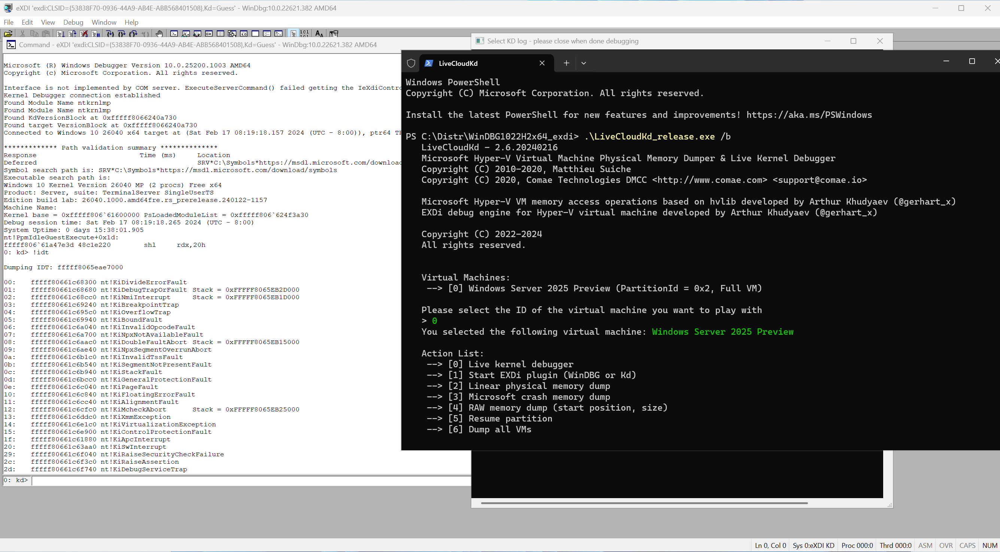

This is fork of LiveCloudKd early developed by Matt Suiche [@msuiche](https://www.twitter.com/msuiche) - https://github.com/msuiche/LiveCloudKd

## LiveCloudKd (2023).

LiveCloudKd is tool, that allows you connect to Hyper-V guest VM with kd.exe (or WinDBG.exe and WinDBG with modern UI (ex. WinDBG Preview). Also you can you Hvmm EXDi plugin for attaching to Hyper-V VM
Tool uses Hyper-V memory manager plugin for operations with Hyper-V memory.

Tool has additional options in compare with LiveKd from Microsoft Sysinternals Suite:

1. Write capabilities (you can write to Hyper-V VM in virtual and physical address space using native WinDBG commands)
2. More performance
3. Support Hyper-V VM with nested option enabled on Intel based CPU
4. Support multilanguage OS

LiveCloudKd. [Download](https://github.com/gerhart01/LiveCloudKd/releases/download/v2.5.5.20230530/LiveCloudKd.v2.5.5.20220530-release.zip)
Contains EXDi plugin



LiveCloudKd based on hvlib.dll library (Hyper-V memory manager plugin). Other tools, that were developed using this library:

LiveCloudKd EXDi debugger. [Download](https://github.com/gerhart01/LiveCloudKd/releases/download/v1.0.22021109/LiveCloudKd.EXDi.debugger.v1.0.22021109.zip). [Readme](https://github.com/gerhart01/LiveCloudKd/blob/master/ExdiKdSample/LiveDebugging.md)    
Hyper-V Virtual Machine plugin for MemProcFS. [Download](https://github.com/gerhart01/LiveCloudKd/releases/download/v2.5.5.20220914/leechcore_hyperv_plugin_14.09.2022.zip)  
Hyper-V Memory Manager plugin for volatility. [Download](https://github.com/gerhart01/Hyper-V-Tools/releases/download/1.0.20221109/Hyper-V.Memory.Manager.plugin.for.volatility.v1.0.20221109.zip)  

Methods for accessing guest Hyper-V VM Memory: 

	ReadInterfaceWinHv - uses Hyper-V hypercall for reading guest OS memory. Slow, but robust method; 
	ReadInterfaceHvmmDrvInternal - read data directly from kernel memory. Faster, then ReadInterfaceWinHv, but uses undocument structures). See description of -m option. Default reading method is ReadInterfaceHvmmDrvInternal.
	
	WriteInterfaceWinHv - uses Hyper-V hypercall for writing to guest OS memory.
	WriteInterfaceHvmmDrvInternal - write data directly to kernel memory. Faster, then WriteInterfaceWinHv, but uses undocument structures). See description of -m option. Default writing method is WriteInterfaceHvmmDrvInternal.
	

LiveCloudKd tested on full Windows Server 2016, Windows Server 2019, Windows Server 2022, Windows 10 and Windows 11 operation system (some of preview versions of Windows 11 and Windows Server vNext)

Configure symbol path:

``` 
mkdir C:\Symbols
compact /c /i /q /s:C:\Symbols
setx /m _NT_SYMBOL_PATH SRV*C:\Symbols*https://msdl.microsoft.com/download/symbols
```

For launch:

1. Place LiveCloudKd.exe, hvlib.dll, hvmm.sys to WinDBG x64 folder (tested on WinDBG from WDK 1809 - 22H2).
2. Launch LiveCloudKd.exe with admin rights (It needs Visual Studio 2022 runtime libraries - https://aka.ms/vs/17/release/vc_redist.x64.exe).
3. Choose virtual machine (Full VM only) for inspection.  

Performance comparison with LiveKd from Sysinternals Suite, at the time of release (LiveCloudKd is more performanced about 1000 times using ReadInterfaceHvmmDrvInternal interface):


Project uses diStorm3 library (BSD license) by [Gil Dabah](https://twitter.com/_arkon): [Distorm project](https://github.com/gdabah/distorm)
