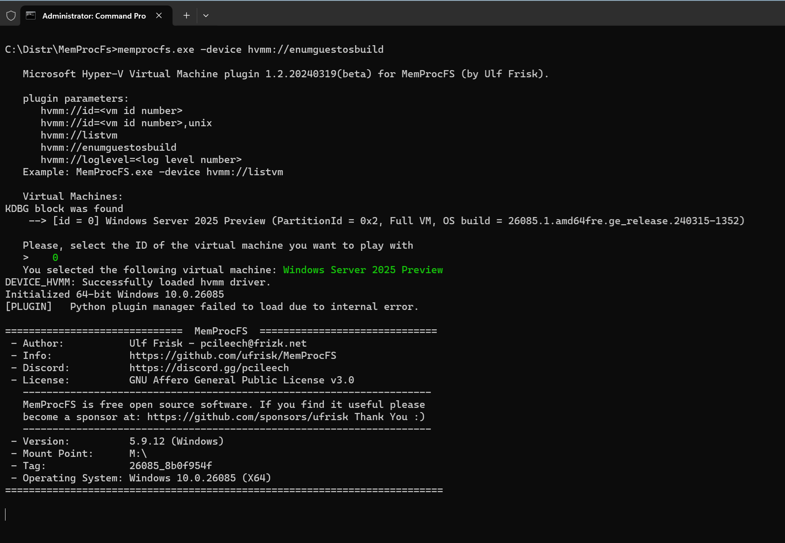
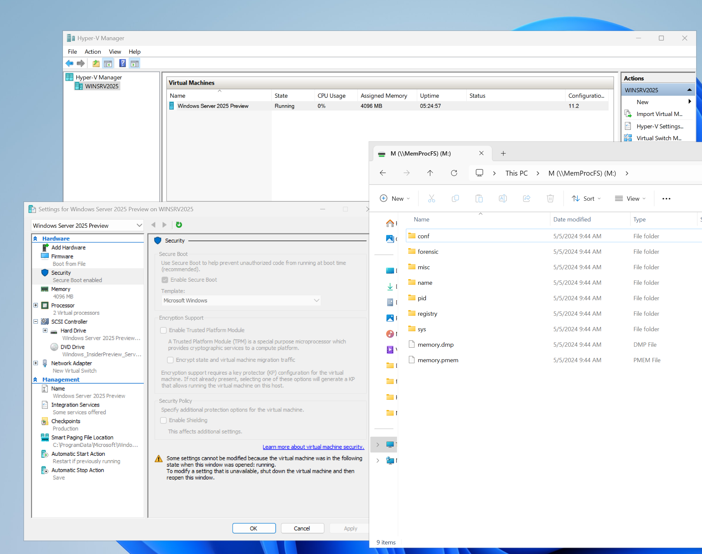

This is MemProcFS plugin for reading Hyper-V memory using Hyper-V Memory Manager library

Sources was taken from https://github.com/ufrisk/LeechCore

- MemProcFs can be found on https://github.com/ufrisk/MemProcFS by @ulfrisk

- LiveCloudKd: https://github.com/gerhart01/LiveCloudKd

Copy leechcore_device_hvmm.dll with hvlib.dll and hvmm.sys to MemProcFS folder

start MemProcFs:
```
MemProcFS.exe -device hvmm -v
```

you must see something like that:



Next you can go to M: driver and use pypykatz plugin, f.e.



Also you can read instructions about plugin usage at:
https://github.com/ufrisk/LeechCore/wiki/Device_LiveCloudKd
